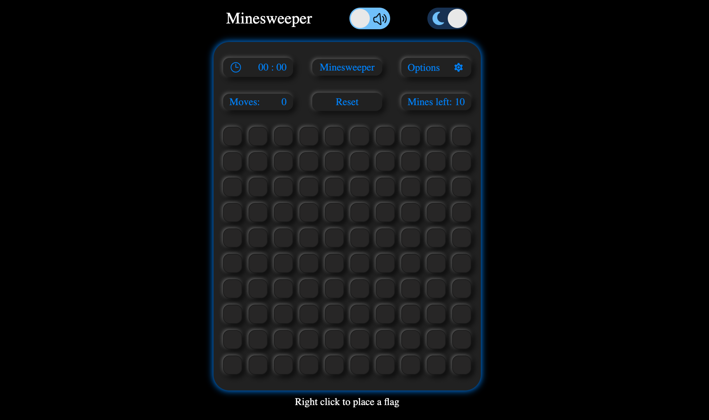

## Minesweeper

### Link to the project: https://adzhigitovruslan.github.io/minesweeper/

## Description

Minesweeper is single-player logic-based computer game played on rectangular board whose object is to locate a predetermined number of randomly-placed "mines" in the shortest possible time by clicking on "safe" squares while avoiding the squares with mines.

## Tech stack

- JS
- SCSS
- HTML